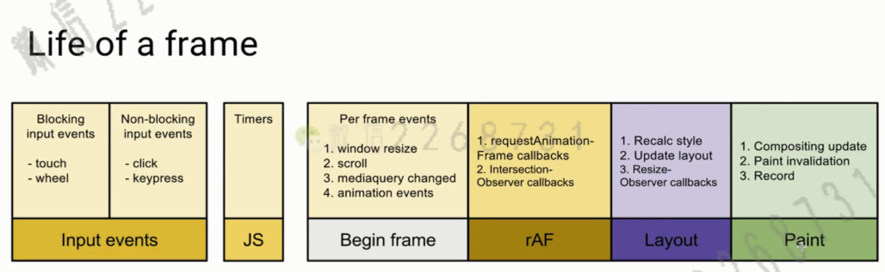

## 浏览器渲染过程
    自己理解
    1、解析(Parse HTML) 获取 dom 树、css 树。然后在合并成渲染树
    2、重新计算样式(Recalculate Style)
        计算css样式
    3、布局(layout)
        根据节点的大小、位置对页面进行布局
    4、更新图层树(update layer tree)
        然后更新图层树
    5、绘制(paint)
        绘制到页面中
    6、复合层(layers) 生成复合层 compassitor(这个主要是将分而治之,更新的时候只在自己的图层中更新) 然后呈现给用户
    7、调用一些 脚本js
    8、重复 1~7过程 后续可能会操作 dom 会重复上述部分步骤。
## 浏览器渲染的流程(关键渲染路径)
    1、JavaScript
        (可以用js、css动画、其他api)触发视觉变化
    2、Style
        重新计算css样式
    3、Layout    
        绘制元素到页面上(知道位置、大小)
    4、Paint
        真正绘制
    5、Composite
        然后合并图层然后显示给用户
    6、浏览器可能会优化因为有些样式不需要改变元素样式
        1、浏览器构造模型
        HTML 根据标签生成 DOM(Document Object Modeal)
            HTML -> DOM
        CSS 生成 CSSDOM 对象
            CSS -> CSSDOM
        DOM & CSSDOM  合并 成渲染树(render Tree)
            根据 cssdom 中的内容决定位置、大小、尺寸以及渲染出来不

## 布局与绘制 (Layout) - (Paint) 只关心大小和位置
    渲染树只包含网页需要的节点
    布局计算每个节点精确的的位置和大小 -盒子模型-
    绘制是像素化每个节点的过程
    
    1、影响回流的操作(当页面第一次加载叫做布局) 后续因为操作了一些api回重新布局(叫做回流)
        添加/删除删除
        操作 style
        dispaly: none
        移动元素位置
        offset、scroll、clientWidth
        修改浏览器大小、字体大小
        
        尽可能避免回流如果实在无法避免需要小心
            Layout Thrashing(布局抖动)
        1、因为浏览器可能提供性能延迟一些回流(将一些列操作在一个时间段执行)
            但是当用户获取某一些数据属性时，浏览器不得不立即执行重绘
                e.g： offsetTop 已更新最新的布局
        2、避免这些问题
            - 避免回流
                1、某些动画可以使用 trasform 这个只回出发 复合(Composite) 不会触发 回流与重绘
            - 读写分离
                1、先读取一些信息，积攒后
                2、在使用数据统一写入。
            使用 fastDom(避免抖动) 读写分离
                measure 测量
                mutate 计算
    
    
## 复合线程(compositor thread) 与图层(layers)
    1、为了提高绘制的效率，复合把页面拆解成不同的图层，有时候某些操作会影响页面视觉变化
        这样子它只会影响某些图层而不是全部图层类似于散列表可以快速定位到图层，修改某个图层而不影响其他图层
    2、页面拆机图层
        1、默认是浏览器拆解
            元素是否相互有影响根据影响大小而拆分
        2、主动提取将某些元素独立成图层

    这几个属性只会触发复合(compositor) 不会触发重绘从而提高性能
     transorm translate、scale、rotate、opacity
    3、使用 will-change 可以根据自己的需要生成一组图层。
## 减少重绘(repaint)
    1、减少重绘的方案
        利用 DevTools 识别 paint 的瓶颈
        利用 will-change 创建新的图层(因为浏览器在分图层的时候 可能这个图层会影响到其他图层导致发生重绘)

## 高频 时间处理函数 防抖
    如、scroll、move、touch
    
    使用 reuqeustAanitionFrame 在一定的时间进行回避
    也可以使用 setTimeout 来实现
    requestAnimationFrame 在每次重绘之前执行
    
## 时间调度原理
    requestAnimationFrame 在 Layout 和 paint 之前
        当页面不可见是不会执行的w
    requestIdiaCallback 之后 在一帧完了之后 还有空闲的时间就执行
    
